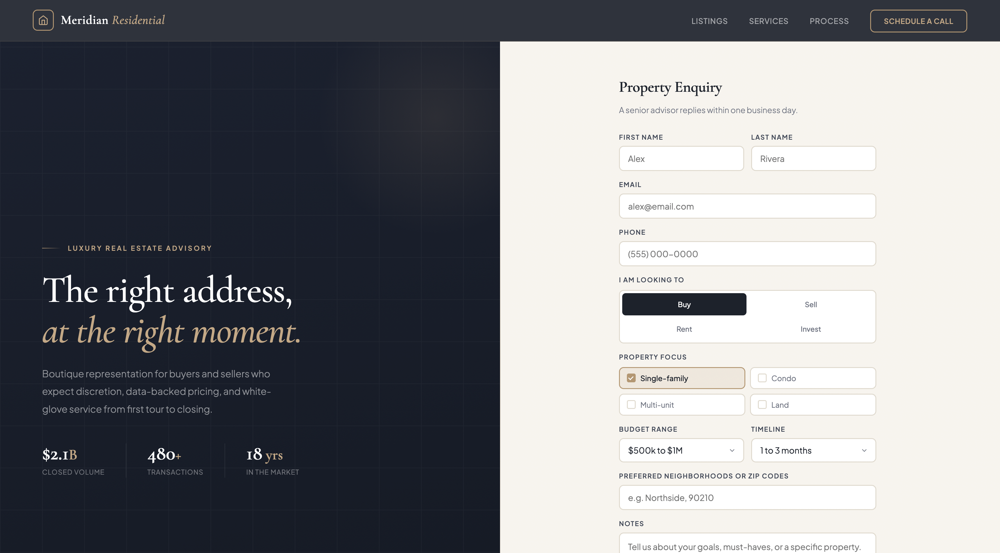

# Formgrid Examples

Free, professional HTML templates for
collecting form submissions. Powered by
Formgrid.dev — no backend required.

## Industry Templates

| Template | Preview | Description |
|---|---|---|
| [Plumber](./industries/plumber) |  | Service request and quote form |
| [Photographer](./industries/photographer) |  | Booking and package selection |
| [Cleaning Service](./industries/cleaning-service) |  | Appointment and service form |
| [Real Estate](./industries/real-estate) |  | Property enquiry form |

## How to Use Any Template

1. Clone this repo
2. Open the folder for your template
3. Create a free account at formgrid.dev
4. Replace YOUR_FORMGRID_ENDPOINT_URL
   with your endpoint
5. Deploy anywhere for free

## Free Hosting Options

- GitHub Pages
- Netlify
- Cloudflare Pages

## Powered by Formgrid

All templates use Formgrid.dev as the form
backend. Free plan includes 50 submissions
per month. No credit card required.

👉 formgrid.dev
